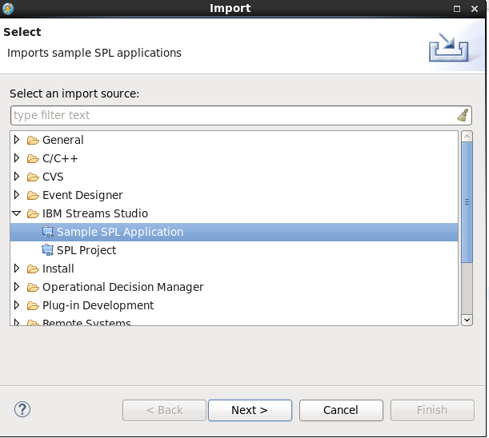
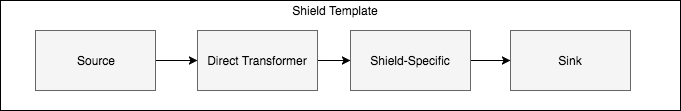
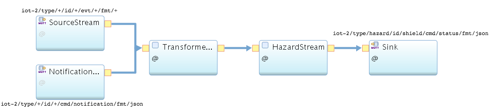
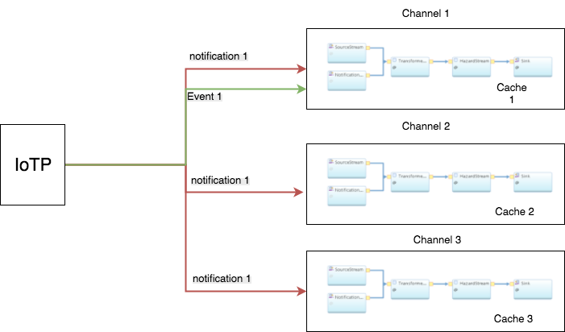

## How to setup dev environment for IBM streams

- The fastest way to start developing using IBM streams is by using the [Streams Quick Start Edition VM](https://www-01.ibm.com/marketing/iwm/iwm/web/preLogin.do?source=swg-ibmistvi&S_TACT=000000VP&S_OFF_CD=10000737).
- Steps to set the VM up using VirtaulBox are [here](https://developer.ibm.com/courses/labs/install-quick-start-edition-dwc009/).
- Import the current project as IBM streams studio SPL application as shown below:

 
  
 
## Shield template overview
 
 
 The shield template is an spl application with the ability to write custom primitive operators or functions in Java.
 The shield will contain the following spl operators. 
 

 
##### Source Operator 
 This is a source operator based on the [messaging toolkit](https://github.com/IBMStreams/streamsx.messaging). The main task of this operator is to subscribe to all events from the tenant IoTP and pass it to the other operators.

##### Direct Transformer
This is a custom primitive operator written in Java that allows the shield developer to select the attribute in the event payload/topic that contains the gateway ID. Then this operator will add the user info to the payload and pass it to the other operators.
The benefit of having the direct transformer as IBM streams operator are listed below:
 - We won't have to publish the events twice to the IoTP which is expensive. 
 - We can easily scale the direct transformer using IBM streams.
 - The shield developer can select the gateway ID which can be different from gateway to gateway.
 - Having the direct transformer as operator in the shield allow us to easily add the logic needed to check if the user has activated the shield or not and filter the events accordingly. This can be also optional based on the shield developer wish.
 
 
##### Shield-Specific 
  
This is were the shield developer adds his own simple/complex logic for the shield.

##### Sink operator 
This is the sink operator which is based on the [messaging toolkit](https://github.com/IBMStreams/streamsx.messaging) and is used to publish the hazards to the tenant IoTP.

## Shield operators dependencies

The shield operators will require some parameters as explained below:

##### Source and Sink Operators
 
 The source and sink operators will need the following params that will be provided by the API service at the that time of submitting the job:
 - $ORG
 - $AUTH_KEY
 - $AUTH_TOKEN
 - $QOS
 
##### Direct Transformer
We are using a read-only cloudant key per tenant that will be generated by the service broker to access the device-to-user and user-to-shield-activations mappings.
The following are the params needed by the direct transformer:
- $DB_NAME ==> will be provided by the API service at submission time.
- $DB_HOST ==> will be provided by the API service at submission time.
- $DB_USER ==> will be provided by the API service at submission time.
- $DB_PASSWORD ==> will be provided by the API service at submission time.
- $SHIELD_ID ==> will be provided by the API service at submission time.
- deviceIdAttributeName ==> needs to be provided by shield developer. This is the name of the attribute in the payload that contains the gatewayId. Use "topic_id" if the gateway ID is in the topic.
- checkShieldActivationRule ==> needs to be provided by shield developer to determine if we should filter events when user didn't activate this shield.

## Caching and scaling shield

The only operator that require caching is the Direct Transformer and for that we are using in-memory cashing for performance reasons. The operators caches all the device-to-user and user-to-shield-activation mappings at the beginning. 
Then to validate the cache, we use notification events from the API service in the following two scenarios:
- whenever a new device added or existing device modified.
- whenever a user activated a new shield or modified existing activations

So we have two source operators, one for the device events and one for the notifications as shown below:

When the shield is deployed in multiple channels (@parallel > 1), the SourceStream is subscribing to IoTP in a [scalable way](https://developer.ibm.com/recipes/tutorials/shared-subscription-in-ibm-iot-foundation/) and the NotificationStream use the normal way. In this way, if we receive a device event, it will be distributed among all the SourceStream clients that are deployed in different processing elements (PEs). However since each PE will have it is own cache, the same notification will be sent to all the PEs.  

##### required notifications
- an event with topic iot-2/type/IoT4i_deviceMappingChange/id/{vendorId}/cmd/notification/fmt/json ==> when a device changed (create,update,replace,delete)
- an event with topic iot-2/type/IoT4i_userActivationChange/id/{userId}/cmd/notification/fmt/json ==> when a shield activation changed (create,update,replace,delete)

##### required views
- devices_by_vendorId
- shield-activations_by_userId

## A demo operator for simple shield
A custom primitive operator called SimpleShield is created in the template that can be used in the shield-specific stage for testing/demo purposes.
This operator can be used to generate hazards based on simple patterns like crash,water-leakage, etc.. 
The operator requires the following parameters:

- $SHIELD_ID ==> will be provided by the API service at submission time.
- operationType ==> provided by shield developer, could be one of the values (greaterThan, LessThan, equals, greaterThanOrEquals, lessThanOrEquals).  ;
- attributeName ==> provided by shield developer which is the attribute name to check. Example: "isCrash"
- attributeValue ==> provided by shield developer which is the threshold that generate hazard. Example:  "true" 
- hazardTitle ==> provided by shield developer which is the hazard title. Example: "Crash detected." 

## links to code

- [The main spl application](application/ShieldTemplate.spl)
- [The direct transformer operator java code](impl/java/src/application/Transformer.java)
- [The simple shield demo operator java code](impl/java/src/application/SimpleShield.java)